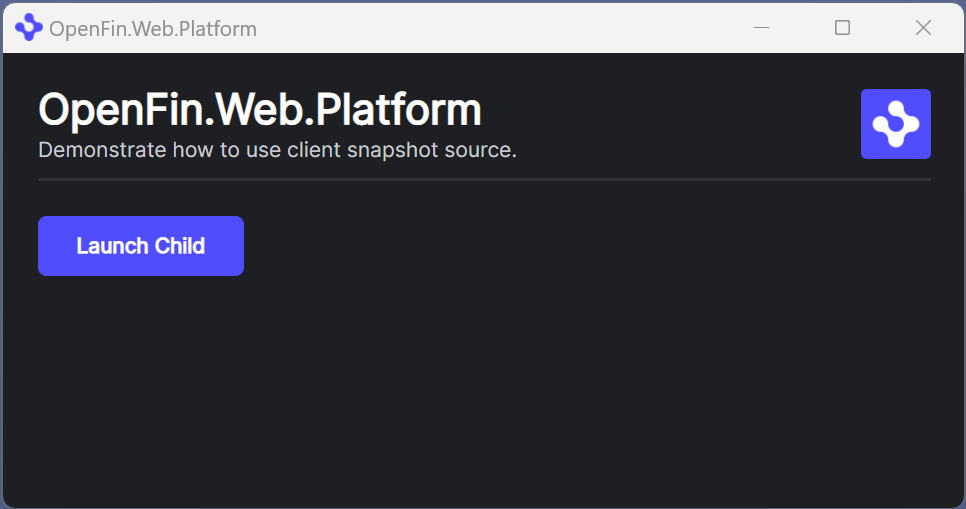

# OpenFin Create A Snapshot Source Client

This example demonstrates creating a snapshot source client in your platform and calling it from a C# application.

## Running

First open the **OpenFin.SnapshotSourceClient.sln** solution, and then in the solution properties make sure that the **Startup Project** is set to **Multiple Projects**. 
Set the action for both projects to **Start**.

Now when you start the project it will launch both the web server for the platform, and a WPF app to perform the C# interactions.

When the WPF application has launched it should appear as follows:

By clicking the **Launch Platform** button this will request the **manifest.fin.json** from the Web Server and create an OpenFin platform. You should see the following window appear.

You can use the **Launch Child** button to launch multiple child windows from the platform app.

Your screen should now look something like this:

In the WPF app you can now click **Get Snapshot** which will grab the current layout and store it in the WPF application.  
In the platform window you should see **getSnapshot Called** message.

You can now close the child windows, but leave the platform window open.

Click **Apply Snapshot** in the WPF application and all of your child windows should re-appear in their original locations. In the platform window you should see **applySnapshot Called** message.
