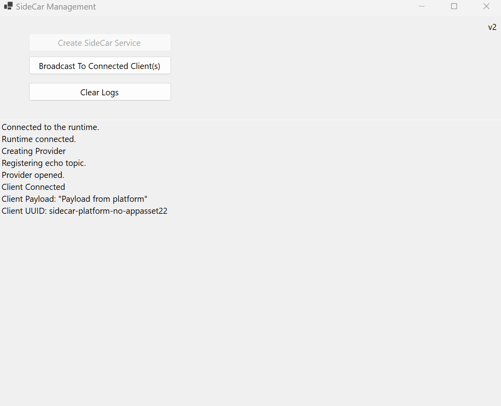
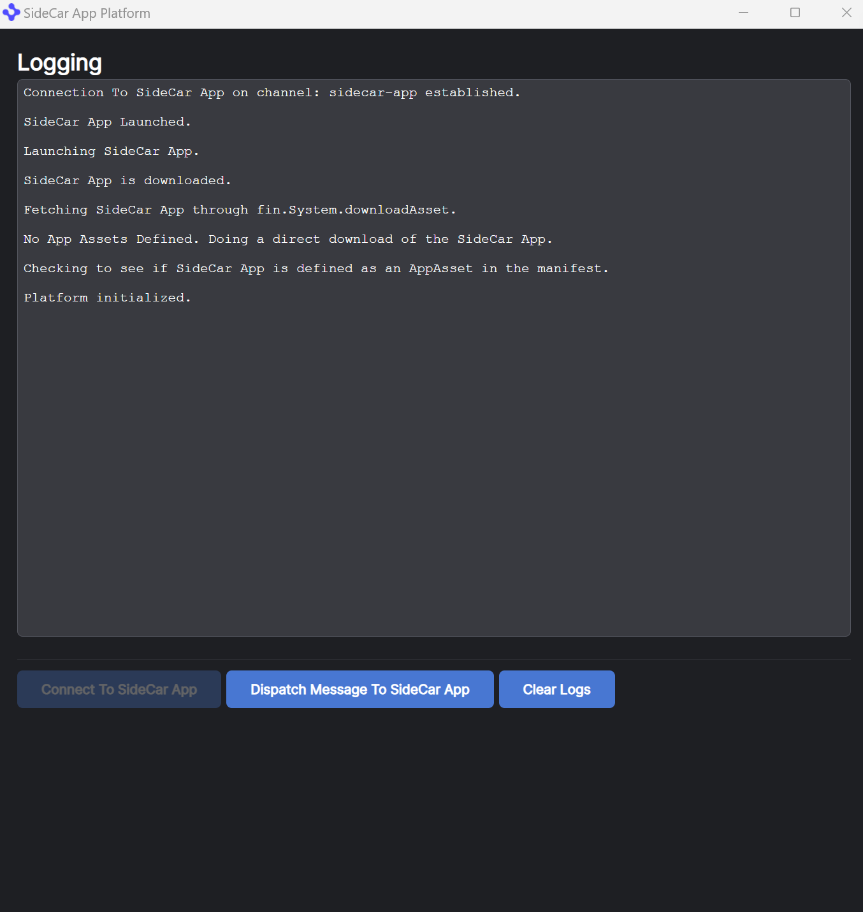

# How To Use A SideCar App - Basic

## Native SideCar App

This is a very basic example of a platform app being launched that has a native app as a dependency.

The SideCar Application in this case is a C# application that:

- Allows messages to be sent to it (it echos the message back)
- Broadcasts a message to all connected clients

### SideCar App UI



The SideCar App is a Winform App which is visible when launched (a traditional helper app would not be visible). It includes a simple log view as some buttons to:

- Create a SideCar Service - when the platform launches the SideCar App it tries to connect to this service and waits. When this button is pressed it allows the platform to connect.

- Broadcast To Connected Client(s) - The Winform App will Broadcast a message to all connected clients.

- Clear Logs - Simply clears the messages to make it easier to the status messages.

The SideCar App will close when the Platform App is closed as we link it to the lifetime of the Platform when it is launched via Launch External Process.

The SideCar App Solution file can be found in [sidecar-app/SideCar.App.sln](./sidecar-app/SideCar.App.sln). The solution uses Visual Studio 2022 and targets .NET 6.

When the solution is build the app is zipped up and copied to [platform/public/assets/sidecar-app.zip](./platform/public/assets/sidecar-app.zip). We include a prebuilt zip in case you do not have access to Visual Studio 2022.

## SideCar Platform App

The Platform app is very basic. It fetches the SideCar App, launches it and tries to connect to the it. It registers a function that can be called by the SideCar App and gives the option of calling a function on the SideCar App.

### SideCar Platform App UI



The SideCar Platform App has two manifests:

- [manifest.fin.json](./platform/public/manifest.fin.json) - this manifest includes the permissions you need in order to download an app asset and launch it. This manifest **does not** include an AppAsset definition and the sample will fetch the AppAsset through code written in the provider [provider.ts](./platform/client/src/provider.ts).

- [second.manifest.json](./platform/public/second.manifest.fin.json) - this manifest includes the permissions you need in order to download an app asset and launch it. This manifest **does** include an AppAsset definition so the RVM will automatically download the AppAsset before the platform is launched.

The buttons perform the following functions:

- Connect To SideCar App - This button checks to see if an AppAsset has been defined in the manifest. If it has it means the RVM has fetched the asset already, otherwise it defines an AppAsset and downloads it using the OpenFin API. It will then launch the asset through the LaunchExternalProcess API and connects to it using our Channel API (once the native app is launched you need to click the create service button for it to connect).
- Dispatch Message To SideCar App - The platform app uses the client connection to the SideCar App to send a message and receive a response from the SideCar App.
- Clear Logs - simply clears the panel to make it easier to see status messages.

## Building the Native applications

1. Each application has its own solution.
2. Ensure that the OpenFin packages are installed.
3. Build the solution normally.

## Build the Platform application

1. Ensure that you are in the sub-folder that contains the code.

2. Run

   ```
   npm run setup
   ```

    to install the dependencies

3. Run

   ```
   npm run build
   ```

    to build the client component.

   - **Note**. Please remember to repeat steps 1 though 3 each time you modify the code.

4. Run

   ```
   npm run start 
   ```

   to start the generic http server that will serve static files.

5. Open a new Terminal / Command Window in the same sub-folder as step 1. Run

   ```
   npm run client
   ```

    to run the client component.

## Testing end to end process flow

To go through the flow you can run client (step 5 above).

You can then use the Platform UI to trigger the following flow:

