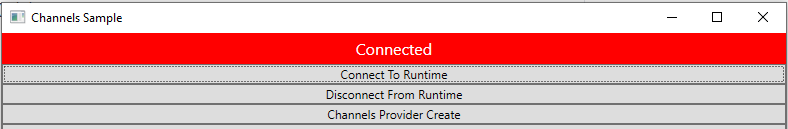
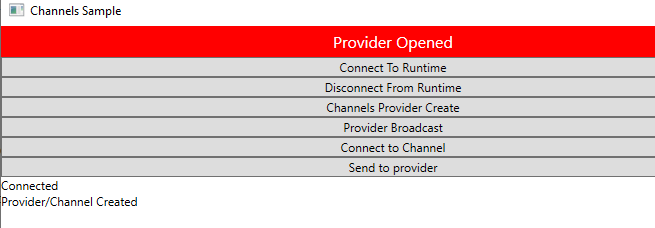
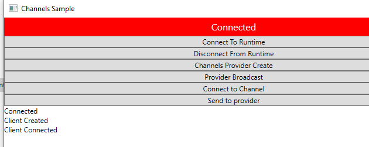
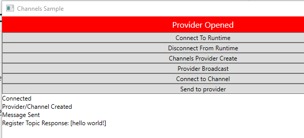
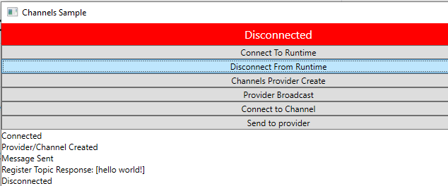

# Example of Channel API communication

## How to run this example

1. Ensure that you have installed the following nuget packages:  
- OpenFin.Net.Adapter (minimum 29.2.0)  
- OpenFIn.Net.Adapter.Logs.Serilog (minimum 29.2.0)  
2. Build the solution without errors
3. Navigate to the folder that has the executable, typically this will be in "how-to.v2\use-channels-api\bin\Debug\net6.0-windows"  
4. Run the Channels.exe twice.  
5. Click on "Connect To Runtime" in both instances. 

 

Verify that you get the "Connected" message in the red box at the top.

6. In one instance click on "Channels Provider Create". 

 

Verify that you get a message "Provider Opened" in the red box at the top. 

7. In the second instance click on "Connect to Channel". 

 

Verify that you get a message "Client Connected" in the red box at the top.

8. Click "Provider Broadcast" in the first instance (see step 6). You should see a message appear under the buttons in the second instance (see step 7). 

9. Click "Send to Provider" in the second instance, and you should see a message appear in the first instance, under the buttons.  

10. Please make sure that you click "Disconnect from Runtime" in both instances once you have verified that the tests are working, and prior to closing the windows.
 
 