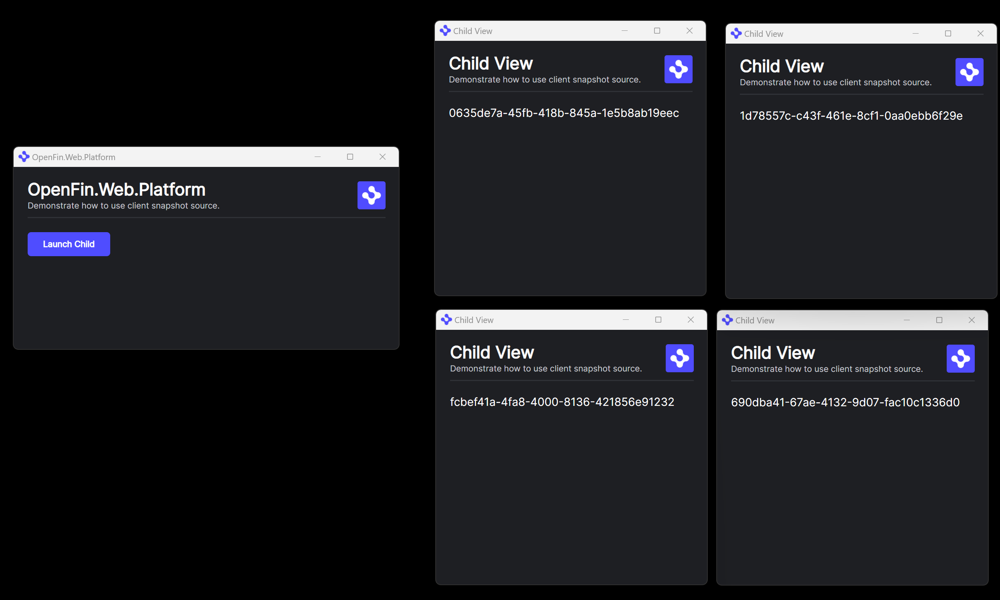

# OpenFin Create A Snapshot Source Client

This example demonstrates creating a snapshot source client in your platform and calling it from a C# application.

## Running

To run the solution just start all the projects, this will launch both a small web server to platform, and a WPF app to perform the C# interactions.

The WPF application is launched it should appear as follows:

By clicking the **Launch Platform** button this will request the manifest.fin.json from the Web Server and create an OpenFin platform, you should see the following window appear.

You can use the **Launch Child** button to launch multiple child windows from the platform app.

Your screen should now look something like this:

In the WPF app you can now click **Get Snapshot** which will grab the current layout and store it in the WPF application. In the platform window you should see **getSnapshot Called** message.

You can close the child windows, but leave the platform window open.

Now click **Apply Snapshot** in the WPF application and all of your child windows should re-appear in their original locations. In the platform window you should see **applySnapshot Called** message.
